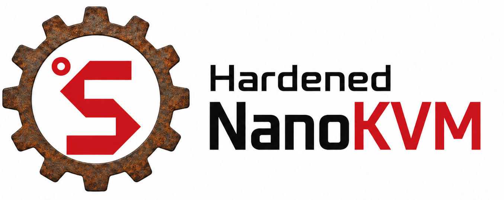

# Hardened NanoKVM

<p align="center">
  
</p>

<div align="center">
  <br>
  
  <h3>
    <a href="https://wiki.sipeed.com/hardware/en/kvm/NanoKVM/introduction.html">🚀 Quick Start</a>
     |
    <a href="https://cn.dl.sipeed.com/shareURL/KVM/nanoKVM">🛠️ Hardware Details</a>
     |
    <a href="https://github.com/woffko/Hardened_NanoKVM/releases/latest">💾 Hardened Releases</a>
  </h3>
  <br>
</div>

## Hardened NanoKVM

Hardened NanoKVM is a beta fork of Sipeed NanoKVM focused on replacing the
privileged Go web backend with a smaller Rust backend while keeping the existing
NanoKVM hardware, web UI, native video pipeline, and service layout.

The project goal is not to rewrite the whole firmware. The Rust backend remains
a drop-in replacement for `NanoKVM-Server` and continues to use the existing
`kvm_system`, `libkvm.so`, USB gadget setup, Maix multimedia stack, and frontend.
The original Go backend is still kept as a fallback for comparison and recovery.

The web UI currently brands this fork as **Hardened NanoKVM** and reports
application version **beta - 1.0.1**.

The current public beta release is published from the `woffko` fork at
[`hardened-rust-beta-1.0.1`](https://github.com/woffko/Hardened_NanoKVM/releases/tag/hardened-rust-beta-1.0.1).

## Current Beta Status

This fork is usable for active device testing, but it is not a finished firmware
release. The current development flow is to run the Rust backend on a real
NanoKVM device, compare behavior against the original Go backend, and port or
harden one subsystem at a time.

| Area | Status |
| --- | --- |
| Rust backend | Runs on the device as a replacement `NanoKVM-Server`. |
| Go fallback | Preserved and switchable from the web UI. |
| Web UI | Existing React UI is retained, with Hardened branding and a backend switch. |
| HTTPS | Implemented in Rust with HTTP-to-HTTPS redirect and existing cert config support. |
| Authentication | First-boot web account setup, Rust sessions, CSRF protection, Origin checks, rate limiting, security headers, Argon2id for new passwords, legacy bcrypt verification. |
| Video | H.264 Direct is the preferred low-CPU mode and is verified on hardware. MJPEG remains available as a fallback. H.264 WebRTC is enabled; websocket signaling is verified and browser media validation is ongoing. |
| HID | Keyboard/mouse websocket, queued HID writes, paste, shortcuts, HID mode, reset, and mouse jiggler are implemented. |
| Device settings | Hostname, web title, GPIO/ATX, OLED, HDMI, SSH, mDNS, swap, memory limit, TLS toggle, reboot, scripts, and autostart have Rust endpoints. |
| Storage | ISO listing, upload, mount, delete, and CD-ROM mode are implemented with path validation. Remote ISO download exists behind a disabled-by-default safety toggle and validates URL, filename, size, destination, and ISO format. |
| Network | WOL, DNS, Wi-Fi status/connect/AP verification, and Tailscale lifecycle endpoints are implemented. |
| Updates | Beta online/offline `kvmapp` updates are implemented through GitHub Releases with sha512 verification from `latest.json`; signed release verification is still pending. |
| SD image | `make sd-image` patches a trusted NanoKVM Rev1.4.2 base image with the current Hardened `kvmapp`; a reproducible full vendor-SDK image build is planned but not established yet. |
| System updates | Planned as a separate GUI updater for vendor-kernel security backports. It is not implemented yet and will require signed manifests, staging, rollback, and boot health checks. |

## What Changed In This Fork

- Added `server-rust/`, a Rust backend that preserves the existing API envelope
  and device runtime layout.
- Added hardened auth/session handling: generated per-device secret, CSRF token
  binding, Origin checks, login lockout, explicit session revocation, and safer
  password storage.
- Added a first-boot setup screen for new SD-card flashes. If `/etc/kvm/pwd`
  does not exist, the web UI requires creating the first administrator account
  before normal login is available. Lost credentials are recovered by reflashing
  the SD card.
- Added Rust implementations for the main browser workflows: login, static UI,
  MJPEG, H.264 Direct, H.264 WebRTC signaling, HID, terminal, storage, network,
  Tailscale, scripts, and many VM settings routes.
- Added shared video fanout for MJPEG and H.264 Direct, so multiple viewers do
  not multiply native capture reads. The web UI now defaults new sessions to
  H.264 Direct when HTTPS and WebCodecs are available, otherwise to H.264.
- Added safer file and command handling for script upload/run, autostart files,
  ISO upload, storage image paths, GitHub update archives, and privileged shell
  calls.
- Added guarded remote ISO download by URL, disabled by default and controlled
  from Settings > Appearance.
- Added a web UI switch under **Settings > Device > Advanced**:
  **Enable Hardened Backend** toggles between Rust/Hardened and the original Go
  backend.
- Added device uptime to About and a Settings > Device session lock selector
  for 5, 15, 30, and 60 minute sessions.
- Added persistent backend binaries under `/kvmapp/backends/`:
  `NanoKVM-Server.rust` and `NanoKVM-Server.go`.
- Made `S95nanokvm` startup idempotent for testing: stale `S95nanokvm.*`
  backup scripts are removed from boot autostart, existing runtime processes
  are stopped before copy/start, stale web backup directories are removed from
  `/kvmapp/server`, and HTTPS port 443 is explicitly allowed.
- Updated branding: login screen, toolbar, and About page identify the Hardened
  build, and the login screen and toolbar use the Hardened NanoKVM wordmark.

## Backend Switching

For test devices, backend switching is handled by scripts installed under
`/etc/kvm/scripts/`:

```text
switch-backend-rust.sh
switch-backend-go.sh
```

Both scripts copy the selected backend into `/kvmapp/server/NanoKVM-Server` and
then use the stock `/etc/init.d/S95nanokvm restart` flow. This keeps the upstream
runtime behavior while avoiding extra backup binaries inside `/kvmapp/server`,
which would otherwise consume too much `/tmp` space during service startup.

The web UI switch calls these scripts through the existing custom-script API, so
it works from either backend. When the Rust backend is active,
`GET /api/health` returns:

```json
{"code":0,"msg":"success","data":{"backend":"rust","phase":"skeleton","status":"ok"}}
```

On the Go backend, `/api/health` is expected to return 404.

## Still Not Finished

- Full API parity is not complete. Some routes are implemented for compatibility
  but still need deeper behavior and edge-case testing against the Go backend.
- H.264 WebRTC needs more browser/ICE stress testing across reconnects and
  browser variants. H.264 Direct has been verified against the Rust backend on
  hardware.
- Online update checks read Hardened release metadata from
  `github.com/woffko/Hardened_NanoKVM` and install the release `kvmapp` tarball
  after sha512 verification. Full signed release verification is still pending.
- GUI system updates for kernel/rootfs security backports are planned but not
  implemented. Current GUI updates replace only the `kvmapp` application
  payload.
- Remote ISO download remains disabled by default and needs a final production
  policy before it should be treated as generally safe.
- First-boot/account setup is implemented for Rust/Hardened images. Existing
  test devices can keep their current account file; new default `admin/admin`
  bootstrap is disabled unless explicitly enabled for isolated compatibility
  testing.
- The repository does not build a full boot/rootfs image from SDK sources. The
  current SD-card image flow patches a trusted upstream NanoKVM base image.
- API inventory, recovery docs, rollback docs, and long-run test reports still
  need to be kept in sync with active device testing.

## 🌟 What is NanoKVM?

NanoKVM is a series of compact, open-source IP-KVM devices based on the LicheeRV Nano (RISC-V). It lets you remotely access and control computers as if you were sitting in front of them, making it useful for servers, embedded systems, and other headless machines.

## 📦 Product Family

Choose the NanoKVM model that best fits your deployment:

- **NanoKVM-Cube Lite:** A barebones kit for DIY users and bulk deployments.
- **NanoKVM-Cube Full:** A ready-to-use kit with a case, accessories, and a pre-flashed system SD card.
- **NanoKVM-PCIe:** A PCIe-bracket form factor for internal chassis mounting. It draws power from the PCIe slot and supports optional Wi-Fi and PoE.
- **[NanoKVM-Pro](https://github.com/sipeed/NanoKVM-Pro):** A higher-performance version with major upgrades:
  - **Resolution:** Up to **4K@30fps / 2K@60fps**.
  - **Network:** **1Gbps Ethernet + PoE + Wi-Fi 6**, upgraded from 100Mbps Ethernet.
  - **Latency:** Hardware-accelerated encoding reduces latency from 100-150ms to **50-100ms**.

<div align="center">
  
</div>

> If you are looking for a USB-based KVM solution, check out [NanoKVM-USB](https://github.com/sipeed/NanoKVM-USB).

## 🛠️ Technical Specifications

| Feature            | NanoKVM-Pro                           | NanoKVM (Cube/PCIe)               | GxxKVM                             | JxxKVM                              |
| ------------------ | ------------------------------------- | --------------------------------- | ---------------------------------- | ----------------------------------- |
| Core               | AX630C 2xA53 1.2G                     | SG2002 1xC906 1.0G                | RV1126 4xA7 1.5G                   | RV1106 1xA7 1.2G                    |
| Memory & Storage   | 1G LPDDR4X + 32G eMMC                 | 256M DDR3 + 32G microSD           | 1G DDR3 + 8G eMMC                  | 256M DDR3 + 16G eMMC                |
| System             | NanoKVM / PiKVM                       | NanoKVM                           | GxxKVM                             | JxxKVM                              |
| Resolution         | 4K@30fps / 2K@60fps                   | 1080P@60fps                       | 4K@30fps / 2K@60fps                | 1080P@60fps                         |
| HDMI Loopout       | 4K loopout                            | —                                 | —                                  | —                                   |
| Video Encoding     | MJPEG / H.264 / H.265                 | MJPEG / H.264                     | MJPEG / H.264                      | MJPEG / H.264                       |
| Audio Transmit     | ✓                                     | —                                 | ✓                                  | —                                   |
| UEFI / BIOS        | ✓                                     | ✓                                 | ✓                                  | ✓                                   |
| Emulated USB Keyboard & Mouse | ✓                          | ✓                                 | ✓                                  | ✓                                   |
| Emulated USB ISO   | ✓                                     | ✓                                 | ✓                                  | ✓                                   |
| IPMI               | ✓                                     | ✓                                 | ✓                                  | —                                   |
| Wake-on-LAN        | ✓                                     | ✓                                 | ✓                                  | ✓                                   |
| Web Terminal       | ✓                                     | ✓                                 | ✓                                  | ✓                                   |
| Serial Terminal    | 2 channels                            | 2 channels                        | —                                  | 1 channel                           |
| Custom Scripts     | ✓                                     | ✓                                 | —                                  | —                                   |
| Storage            | 32G eMMC 300MB/s                      | 32G MicroSD 12MB/s                | 8G eMMC 120MB/s                    | 8G eMMC 60MB/s                      |
| Ethernet           | 1000M                                 | 100M                              | 1000M                              | 100M                                |
| PoE                | Optional                              | Optional                          | —                                  | —                                   |
| Wi-Fi              | Optional Wi-Fi 6                      | Optional Wi-Fi 6                  | —                                  | —                                   |
| ATX Power Control  | ✓                                     | ✓                                 | Extra $15                          | Extra $10                           |
| Display            | 1.47" 320x172 LCD / 0.96" 128x64 OLED | 0.96" 128x64 OLED                 | —                                  | 1.68" 280x240                       |
| More Features      | Sync LED Strip / Smart Assistant      | —                                 | —                                  | —                                   |
| Power Consumption  | 0.6A@5V                               | 0.2A@5V                           | 0.4A@5V                            | 0.2A@5V                             |
| Power Input        | USB-C or PoE                          | USB-C                             | USB-C                              | USB-C                               |
| Dimensions         | 65x65x26mm                            | 40x36x36mm                        | 80x60x17.5mm                       | 60x43x(24~31)mm                     |

## 📂 Project Structure

```text
├── kvmapp          # APP update package
│   ├── jpg_stream  # Legacy support for direct updates from older versions
│   ├── kvm_new_app # Triggers components for kvm_system updates
│   ├── kvm_system  # Core KVM application
│   ├── server      # Front-end and back-end integration
│   └── system      # Essential system components
├── web             # NanoKVM Front-end (UI)
├── server          # NanoKVM Back-end (Service)
├── server-rust     # Hardened Rust backend replacement
├── scripts/nanokvm # Device-side helper scripts used while testing this fork
├── docs            # Backend inventory, security notes, and Rust backend status
├── support         # Auxiliary modules (Image subsystem, status, updates, OLED, HID, etc.)
├── ...
```

## 💻 Development

Start with the guide that matches the part of NanoKVM you want to work on:

- **System support modules:** Build and update the low-level hardware support components in [support/sg2002/README.md](support/sg2002/README.md).
- **Backend service:** Set up, build, and understand the Go service in [server/README.md](server/README.md).
- **Hardened Rust backend:** Build, package, and test the Rust replacement in [docs/rust-backend.md](docs/rust-backend.md).
- **System update plan:** Track planned GUI system updates for vendor-kernel security backports in [docs/system-update-plan.md](docs/system-update-plan.md).
- **System update releases:** Package future kernel/rootfs update bundles for GitHub-hosted channels with [docs/system-update-github-releases.md](docs/system-update-github-releases.md).
- **Security status:** Review hardening scope and remaining risk in [docs/security-risk-inventory.md](docs/security-risk-inventory.md).
- **Frontend UI:** Develop, lint, and build the React interface in [web/README.md](web/README.md).

> Backend compilation and runtime validation require the target toolchain or a NanoKVM device. See the module-specific guides above for the latest development workflow.

## 🔩 Hardware Platform (NanoKVM Cube/PCIe)

NanoKVM is based on Sipeed [LicheeRV Nano](https://wiki.sipeed.com/hardware/zh/lichee/RV_Nano/1_intro.html). You can find specifications, schematics, and dimensional drawings in the [download station](https://dl.sipeed.com/shareURL/LICHEE/LicheeRV_Nano).

The NanoKVM Cube/PCIe hardware is built from these components:

- **NanoKVM Lite:** LicheeRV Nano plus the HDMI-to-CSI board.
- **NanoKVM Full:** NanoKVM Lite plus the NanoKVM-A/B boards and enclosure.
- **HDMI-to-CSI board:** Converts the HDMI input signal.
- **NanoKVM-A board:** Provides OLED, ATX control output through USB-C, auxiliary power, and physical ATX power/reset buttons.
- **NanoKVM-B board:** Connects NanoKVM-A to the host computer's ATX pins for remote power control.

The NanoKVM image is built with the LicheeRV Nano SDK and MaixCDK. It is intended for NanoKVM hardware and is not a general-purpose KVM software package for other LicheeRV Nano or SG2002 products. If you want to build an HDMI input application on LicheeRV Nano or MaixCam, please contact us for technical support.

> Note: Of the 256MB memory on SG2002, 158MB is currently allocated to the multimedia subsystem for video capture and processing.

- [NanoKVM-A Schematic](https://cn.dl.sipeed.com/fileList/KVM/nanoKVM/HDK/02_Schematic/SCH_RV_Nano_KVM_A_30111.pdf)
- [NanoKVM-B Schematic](https://cn.dl.sipeed.com/fileList/KVM/nanoKVM/HDK/02_Schematic/SCH_RV_Nano_KVM_B_30131.pdf)
- [NanoKVM-PCIe Schematic](https://cn.dl.sipeed.com/fileList/KVM/KVM_PCIE/HDK/01_Schematic/SCH_nanoKVM_PCIE_3105D_2025-12-19.pdf)
- [NanoKVM image](https://github.com/sipeed/NanoKVM/releases/tag/NanoKVM)

<div align="center">
  
</div>

## 🤝 Contributing

We welcome contributions. To get started:

1. Fork the repository.
2. Create a feature branch.
3. Commit your changes.
4. Push to the branch.
5. Open a Pull Request.

Please keep your pull requests small and focused to facilitate easier review and merging.

> 🎁 **Contributors who submit high-quality Pull Requests may receive a NanoKVM Cube, PCIe, or Pro as a token of our appreciation!**

## 🛒 Where to Buy

- [AliExpress (global, except USA and Russia)](https://www.aliexpress.com/item/1005007369816019.html)
- [Taobao](https://item.taobao.com/item.htm?id=811206560480)
- [Preorder for other regions](https://sipeed.com/nanokvm)

## 💬 Community & Support

- [Discord](https://discord.gg/V4sAZ9XWpN)
- QQ group: 703230713
- Email: [support@sipeed.com](mailto:support@sipeed.com)
- [FAQ](https://wiki.sipeed.com/hardware/en/kvm/NanoKVM/faq.html)

## 📜 License

This project is licensed under the GPL-3.0 License. See [LICENSE](LICENSE) for details.
